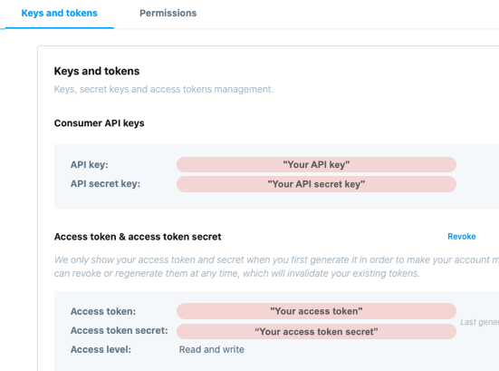

# Twitter Bot

Dockerコンテナ上で動かします.

## 各種設定

Botの設定はworkspace/bot/bot_config.ymlで行います.

```bash
$ cat workspace/bot/bot_config.yml
twitter_api:  # https://developer.twitter.comで取得したキーとトークン情報を入れる
    api_key : "Your API key"
    api_secret_key : "Your API secret key"
    access_token : "Your access token"
    access_token_secret : "Your access token secret"

model: # 学習済みモデルは`workspace/bot/`の下に置く
    filename : model.json

log:
    dirname : logs
    filename : twitter_bot.log
    config : logging_config.yml
```

### Twitter APIの設定

`twitter_api`に取得したキーとトークンを設定します.

キーとトークンは[https://developer.twitter.com](https://developer.twitter.com)で取得します.



`"Your API key"`, `"Your API secret key"`, `"Your access token"`, `"Your access token secret"`の部分をそれぞれ置き換えてください.

|名前|説明|デフォルト|
|---|---|---|
|api\_key|アプリのAPIキー|"Your API key"|
|api\_secret\_key|アプリのAPIシークレットキー|"Your API secret key"|
|access\_token|アクセストークン|"Your access token"|
|access\_token_secret|アクセストークンシークレット|"Your access token secret"|

### モデルの設定

Botを起動する前に学習済みモデルをworkspace/bot/の下に置く必要があります.

|名前|説明|デフォルト|
|---|---|---|
|filename|モデルのファイル名|model.json|

### ログの設定

|名前|説明|デフォルト|
|---|---|---|
|dirname|ログを生成するディレクトリ名|logs|
|filename|生成するログのファイル名|twitter_bot.log|
|config|ログの設定ファイル名|logging_config.yml|


## ツイート頻度の設定

workspace/bot/run.shの`sleep $(($RANDOM % 360 + 420))`の部分を変更してください.

## Botの実行

### 初回時コンテナ作成と起動

uec\_tl\_markovディレクトリの下で実行します.

```bash
$ docker-compose up -d bot
```

コンテナ起動後, Botがツイートし始めます.

### コンテナ停止

```bash
$ docker-compose stop bot
```

### コンテナ削除

```bash
$ docker-compose rm -f bot
```
